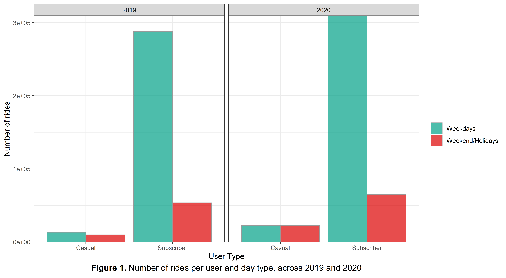
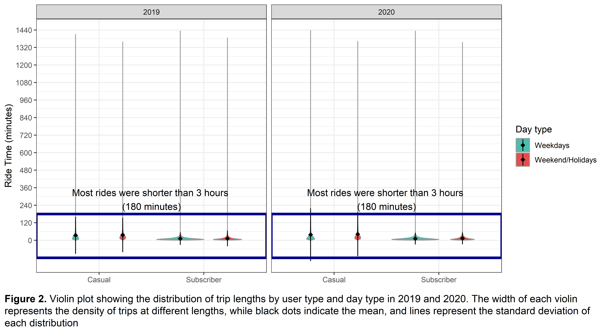
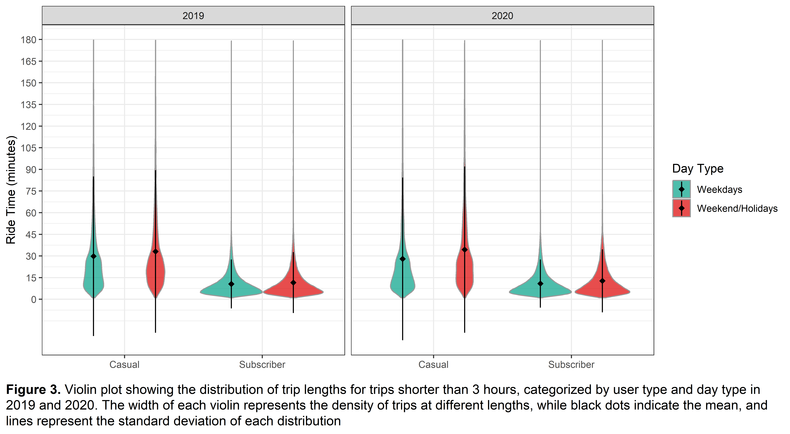
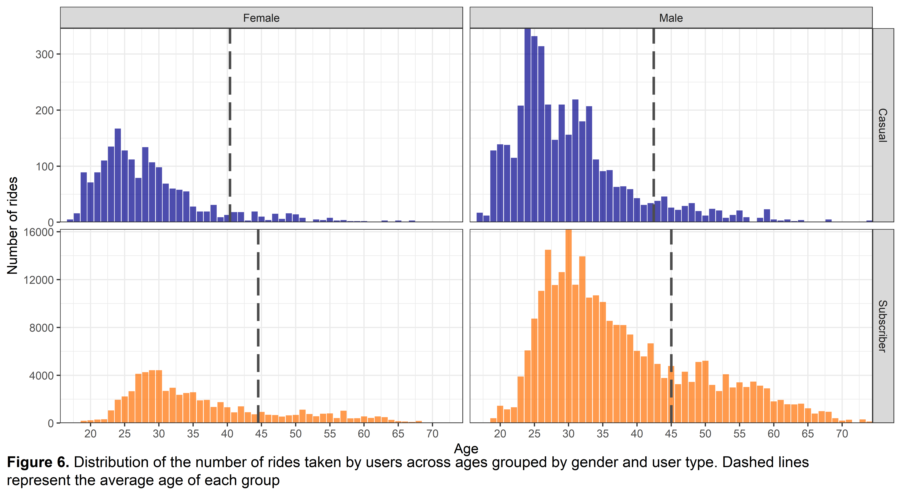

Google Analytics Capstone project
================
2025-03-30

# Cyclistic bike-share analysis 2019-2020

## Background

This case study corresponds to the capstone project of the Google Data
Analytics Course.

Cyclistic is a bike-share program that features more than 5,800
geo-tracked bicycles and 600 docking stations across Chicago. The
service offers several assistive options that make bike-share more
inclusive to people with disabilities and riders who can’t use a
standard two-wheeled bike. These assistive options are used by 8% of
riders.

Cyclistic offers three different plans: single-ride passes, full-day
passes, and annual memberships. Although the majority of users ride for
leisure, about 30% use the bikes to commute to work each day.

Cyclistic’s finance analysts have concluded that annual members
(Subscribers) are more profitable than casual users (Single-ride and
full-day passes). Thus, the director of marketing believes that
maximizing the number of annual members will be key to future growth and
has set a clear goal: **Design marketing strategies aimed at converting
casual users into annual members.** To accomplish this goal it is
necessary to understand the current behavior of annual subscribers and
casual users.

### Business task

The main business task of this case study is to determine how do annual
members and casual users use Cyclistic bikes differently.

### Data source

The data used for this report comprises two .csv files with the details
of bike rides in the first quarters of 2019 and 2020. Both datasets have
information of the start and end times of each ride, the bike stations
where rides started and ended, and the user type (subscriber or casual
user) that booked the ride. Additionally, the 2019 dataset includes
customer demographics, such as gender and birth year, while the 2020
dataset contains the geographic coordinates of the bike stations
involved in each ride.

Although the data provided for this project comes from reliable sources,
it is limited, as it only comprises data from the first three months of
2019 and 2020, and outdated, as it is more than five years old. For the
purpose of this study, data will not be considered outdated, but
conclusions from this analysis can only be deemed relevant for this
fictional study.

## Data preparation

The datasets were cleaned and joined using the *tidyverse* library of
packages in R.

``` r
#Install and load tidyverse library

#install.packages("tidyverse")
library(tidyverse)
```

Both datasets have different number of columns, as well as different
names for columns with the same information. Thus, both datasets were
standardized before joining them into a single dataset.

``` r
#Set working directory 

setwd("C:/Users/javab/Documents/Google Analytics/R/Capstone")

#Load and examine data
bike2019<- read_csv("Divvy_Trips_2019_Q1.csv")
bike2020<- read_csv("Divvy_Trips_2020_Q1.csv")

#Clean and standardize 2019's dataset

#Rename columns and change names of usertype classes
bike2019_clean<-bike2019 %>% rename('start_station'=from_station_name,
                              'end_station'=to_station_name)
bike2019_clean$usertype <- case_match(bike2019_clean$usertype, 
                                      "Subscriber"~"Subscriber", "Customer"~"Casual")
head(bike2019_clean)
```

    ## # A tibble: 6 × 12
    ##    trip_id start_time          end_time            bikeid tripduration
    ##      <dbl> <dttm>              <dttm>               <dbl>        <dbl>
    ## 1 21742443 2019-01-01 00:04:37 2019-01-01 00:11:07   2167          390
    ## 2 21742444 2019-01-01 00:08:13 2019-01-01 00:15:34   4386          441
    ## 3 21742445 2019-01-01 00:13:23 2019-01-01 00:27:12   1524          829
    ## 4 21742446 2019-01-01 00:13:45 2019-01-01 00:43:28    252         1783
    ## 5 21742447 2019-01-01 00:14:52 2019-01-01 00:20:56   1170          364
    ## 6 21742448 2019-01-01 00:15:33 2019-01-01 00:19:09   2437          216
    ## # ℹ 7 more variables: from_station_id <dbl>, start_station <chr>,
    ## #   to_station_id <dbl>, end_station <chr>, usertype <chr>, gender <chr>,
    ## #   birthyear <dbl>

``` r
#Clean and standardize 2020's dataset

#Rename columns and change names of usertype classes
bike2020_clean<-bike2020 %>%rename("start_time"=started_at, "end_time"=ended_at,
                                    'start_station'=start_station_name,
                                    'end_station'=end_station_name, 
                                    "usertype"=member_casual) 
bike2020_clean$usertype <- case_match(bike2020_clean$usertype, 
                                      "member" ~ "Subscriber", "casual" ~ "Casual")
head(bike2020_clean)
```

    ## # A tibble: 6 × 13
    ##   ride_id    rideable_type start_time          end_time            start_station
    ##   <chr>      <chr>         <dttm>              <dttm>              <chr>        
    ## 1 EACB19130… docked_bike   2020-01-21 20:06:59 2020-01-21 20:14:30 Western Ave …
    ## 2 8FED874C8… docked_bike   2020-01-30 14:22:39 2020-01-30 14:26:22 Clark St & M…
    ## 3 789F3C21E… docked_bike   2020-01-09 19:29:26 2020-01-09 19:32:17 Broadway & B…
    ## 4 C9A388DAC… docked_bike   2020-01-06 16:17:07 2020-01-06 16:25:56 Clark St & R…
    ## 5 943BC3CBE… docked_bike   2020-01-30 08:37:16 2020-01-30 08:42:48 Clinton St &…
    ## 6 6D9C8A693… docked_bike   2020-01-10 12:33:05 2020-01-10 12:37:54 Wells St & H…
    ## # ℹ 8 more variables: start_station_id <dbl>, end_station <chr>,
    ## #   end_station_id <dbl>, start_lat <dbl>, start_lng <dbl>, end_lat <dbl>,
    ## #   end_lng <dbl>, usertype <chr>

``` r
# Keep only columns that are present in both dataset, add the year of each dataset
bike2019_clean2<-bike2019_clean %>% select(start_time, end_time, start_station,
                                    end_station, usertype) %>% mutate(year="2019")
bike2020_clean2<-bike2020_clean %>% select(start_time, end_time, start_station,
                                    end_station, usertype)%>% mutate(year="2020")

#Join both datasets
bikes<-rbind(bike2019_clean2,bike2020_clean2)
head(bikes)
```

    ## # A tibble: 6 × 6
    ##   start_time          end_time            start_station     end_station usertype
    ##   <dttm>              <dttm>              <chr>             <chr>       <chr>   
    ## 1 2019-01-01 00:04:37 2019-01-01 00:11:07 Wabash Ave & Gra… Milwaukee … Subscri…
    ## 2 2019-01-01 00:08:13 2019-01-01 00:15:34 State St & Rando… Dearborn S… Subscri…
    ## 3 2019-01-01 00:13:23 2019-01-01 00:27:12 Racine Ave & 18t… Western Av… Subscri…
    ## 4 2019-01-01 00:13:45 2019-01-01 00:43:28 California Ave &… Clark St &… Subscri…
    ## 5 2019-01-01 00:14:52 2019-01-01 00:20:56 Mies van der Roh… Streeter D… Subscri…
    ## 6 2019-01-01 00:15:33 2019-01-01 00:19:09 LaSalle St & Was… Dearborn S… Subscri…
    ## # ℹ 1 more variable: year <chr>

## Data Analysis and Visualisations

### Number and lenght of rides per user type during 2019 and 2020

The ride length of each trip was calculated by subtracting start_time
from end_time to compare riding patterns between subscribers and casual
users. Additionally, a *day_type* column was added to the dataset to
classify trips as either weekday or weekend/holiday trips using the
*chron* package. Trips lasting less than one minute or more than 24
hours were filtered out of the dataset.

``` r
#Load chron package
#install.packages("chron")
library(chron)

#Calculate ride length, and classify trips by weekday or weekend category
bikes2<- bikes %>% mutate(ride_len_min= difftime(end_time,start_time, units = "min"),
                          ride_len_hour= difftime(end_time,start_time, units = "hours"),
                          day_type= ifelse(is.weekend(start_time) | is.holiday(start_time),
                                          "Weekend/Holidays", "Weekdays")) %>%
                    filter(ride_len_hour<24, ride_len_min>1)
head(bikes2)
```

    ## # A tibble: 6 × 9
    ##   start_time          end_time            start_station     end_station usertype
    ##   <dttm>              <dttm>              <chr>             <chr>       <chr>   
    ## 1 2019-01-01 00:04:37 2019-01-01 00:11:07 Wabash Ave & Gra… Milwaukee … Subscri…
    ## 2 2019-01-01 00:08:13 2019-01-01 00:15:34 State St & Rando… Dearborn S… Subscri…
    ## 3 2019-01-01 00:13:23 2019-01-01 00:27:12 Racine Ave & 18t… Western Av… Subscri…
    ## 4 2019-01-01 00:13:45 2019-01-01 00:43:28 California Ave &… Clark St &… Subscri…
    ## 5 2019-01-01 00:14:52 2019-01-01 00:20:56 Mies van der Roh… Streeter D… Subscri…
    ## 6 2019-01-01 00:15:33 2019-01-01 00:19:09 LaSalle St & Was… Dearborn S… Subscri…
    ## # ℹ 4 more variables: year <chr>, ride_len_min <drtn>, ride_len_hour <drtn>,
    ## #   day_type <chr>

After filtering the dataset, a summary table was created by grouping
rides by user type and day type to count the number of rides per user
and day type, as well as to calculate the mean and standard deviation of
trip length for each user type during weekdays and weekends/holidays.
The number of users per group was plotted as a *bar chart*, while the
mean and standard deviation of trip length were incorporated into a
*violin plot* to visualize the distribution of trip lengths, separated
by user type and day type.

``` r
#Calculate mean and sd of ride length grouped by user_type and day_type
bike_sum<- bikes2 %>% group_by(year, usertype, day_type) %>% 
           summarise(count_group=n(),
                     mean_len=round(as.numeric(mean(ride_len_min)),2), 
                    sd_len= round(sd(ride_len_min),2)) %>% 
           unite(mean_sd, c(mean_len,sd_len), sep=" ± ")%>%
           mutate(mean_sd=paste(mean_sd," ", "mins"))

#Summary table 
kable(bike_sum,  col.names = c("Year","User Type", "Day type", "Number of trips", "Mean trip length ± SD"),booktabs = TRUE, align = "c",
      caption = '<b>Table 1.</b> Summary table showing the number of rides, along with the mean and standard deviation (SD) of ride length, grouped by user type and day type.')%>% 
  column_spec(1:2, bold = T,extra_css = "border-bottom: 1px solid;")%>% 
  collapse_rows(1:2,latex_hline = "major", valign = "middle") %>% 
   kable_styling(position = "center") %>% 
  row_spec(c(0), extra_css = "border-bottom: 2px solid;") %>% 
  row_spec(c(2,4,6,8), extra_css = "border-bottom: 1px solid;")
```

<table class="table" style="margin-left: auto; margin-right: auto;">
<caption>
<b>Table 1.</b> Summary table showing the number of rides, along with
the mean and standard deviation (SD) of ride length, grouped by user
type and day type.
</caption>
<thead>
<tr>
<th style="text-align:center;border-bottom: 2px solid;">
Year
</th>
<th style="text-align:center;border-bottom: 2px solid;">
User Type
</th>
<th style="text-align:center;border-bottom: 2px solid;">
Day type
</th>
<th style="text-align:center;border-bottom: 2px solid;">
Number of trips
</th>
<th style="text-align:center;border-bottom: 2px solid;">
Mean trip length ± SD
</th>
</tr>
</thead>
<tbody>
<tr>
<td style="text-align:center;font-weight: bold;border-bottom: 1px solid;vertical-align: middle !important;" rowspan="4">
2019
</td>
<td style="text-align:center;font-weight: bold;border-bottom: 1px solid;vertical-align: middle !important;" rowspan="2">
Casual
</td>
<td style="text-align:center;">
Weekdays
</td>
<td style="text-align:center;">
13366
</td>
<td style="text-align:center;">
34.28 ± 63.26 mins
</td>
</tr>
<tr>
<td style="text-align:center;border-bottom: 1px solid;">
Weekend/Holidays
</td>
<td style="text-align:center;border-bottom: 1px solid;">
9729
</td>
<td style="text-align:center;border-bottom: 1px solid;">
36.68 ± 59.01 mins
</td>
</tr>
<tr>
<td style="text-align:center;font-weight: bold;border-bottom: 1px solid;vertical-align: middle !important;" rowspan="2">
Subscriber
</td>
<td style="text-align:center;">
Weekdays
</td>
<td style="text-align:center;">
288277
</td>
<td style="text-align:center;">
11.11 ± 21.32 mins
</td>
</tr>
<tr>
<td style="text-align:center;border-bottom: 1px solid;">
Weekend/Holidays
</td>
<td style="text-align:center;border-bottom: 1px solid;">
53505
</td>
<td style="text-align:center;border-bottom: 1px solid;">
12.36 ± 26.5 mins
</td>
</tr>
<tr>
<td style="text-align:center;font-weight: bold;border-bottom: 1px solid;vertical-align: middle !important;" rowspan="4">
2020
</td>
<td style="text-align:center;font-weight: bold;border-bottom: 1px solid;vertical-align: middle !important;" rowspan="2">
Casual
</td>
<td style="text-align:center;">
Weekdays
</td>
<td style="text-align:center;">
22120
</td>
<td style="text-align:center;">
38.61 ± 90.27 mins
</td>
</tr>
<tr>
<td style="text-align:center;border-bottom: 1px solid;">
Weekend/Holidays
</td>
<td style="text-align:center;border-bottom: 1px solid;">
22182
</td>
<td style="text-align:center;border-bottom: 1px solid;">
41.69 ± 75.18 mins
</td>
</tr>
<tr>
<td style="text-align:center;font-weight: bold;border-bottom: 1px solid;vertical-align: middle !important;" rowspan="2">
Subscriber
</td>
<td style="text-align:center;">
Weekdays
</td>
<td style="text-align:center;">
309378
</td>
<td style="text-align:center;">
11.3 ± 20.27 mins
</td>
</tr>
<tr>
<td style="text-align:center;border-bottom: 1px solid;">
Weekend/Holidays
</td>
<td style="text-align:center;border-bottom: 1px solid;">
65221
</td>
<td style="text-align:center;border-bottom: 1px solid;">
13.1 ± 20.47 mins
</td>
</tr>
</tbody>
</table>

``` r
#Number of rides per user and day type (Bar Chart)
ggplot(bikes2, aes(x=usertype, fill=day_type))+
  geom_bar(position="dodge",alpha=0.7, color="gray60") +
   scale_y_continuous("Number of rides", expand=c(0,0))+
  scale_fill_manual(values=c("#00A087","#DC0000"))+
  facet_wrap(~year)+
  labs(fill=" ", x="User Type", caption= bquote(bold("Figure 1.") ~ "Number of rides per user and day type, across 2019 and 2020"))+
  theme_bw() + theme(plot.caption = element_text(hjust = 0.5, size = 12))
```



In 2019, the total number of rides was 23,095 for casual users and
341,782 for subscribers, with subscribers accounting for approximately
97% of the total rides. In 2020, the number of rides increased to 44,302
for casual users and 374,599 for subscribers, with subscribers now
representing about 89% of the total. This reflects an increase of
approximately 92% in rides from casual users and a 10% increase in rides
from subscribers between 2019 and 2020. During 2019, weekend and holiday
trips made up 42% of trips for casual users and 16% for subscribers. In
2020, weekend and holiday trips rose to 50% for casual users and 17% for
subscribers (**Table 1**; **Fig. 1**).

The most striking pattern is the substantial rise in rides by casual
users in 2020, which may be linked to the COVID-19 pandemic.
Bicycle-sharing services likely became a more attractive option during
this time, offering a safer alternative to public transportation,
particularly appealing to casual users seeking short-term, low-contact
mobility solutions.

Another notable trend is that nearly half of casual users’ trips were
booked on weekends and holidays, suggesting that casual users may
primarily use the bicycles for recreational purposes. On the other hand,
subscribers tended to book trips more frequently during weekdays, likely
for practical purposes. The low number of casual rides during the first
quarter of the year is likely due to the weather, as Chicago’s winters
are famous for being cold and windy, making recreational bike rides
unattractive during this time.

Unfortunately, concluding how user patterns change over time is
challenging with only two years of data, particularly when this data
comprises only winter months. However, there is a noticeable trend of
more trips being booked by subscribers compared to casual users.

``` r
#Plot distribution of trip lengths (Violin plot)

#Load Hmisc package to visualize mean and sd on plot, and ggtext package to put captions under figures

library(ggtext)
#Violin plot
ggplot(bikes2, aes(x=usertype, y=ride_len_min, fill=day_type))+
  geom_violin(alpha=0.7, color="gray60") +
  facet_wrap(~year)+
  scale_fill_manual("Day type",values=c("#00A087","#DC0000"))+
  stat_summary(fun.data=mean_sdl, 
               position = position_dodge(.9),
               geom="pointrange", color="black",linewidth=0.5,
               shape = 18, size = 0.5)+
  scale_y_continuous("Ride Time (minutes)", seq(0,1440,120))+
  annotate("rect", color = "blue4", alpha = 0, linewidth=1.5,
           xmin =-Inf, xmax = Inf, ymin = -120, ymax = 180) + 
  annotate("text", x = 1.5, y = 270, size=4,
           label ="Most rides were shorter than 3 hours \n(180 minutes)")+
  labs(x=" ", caption = "**Figure 2.** Violin plot showing the distribution of trip lengths by user type and day type in 2019 and 2020. The width of each violin represents the density of trips at different lengths, while black dots indicate the mean, and lines represent the standard deviation of each distribution")+ 
  theme_bw() + 
  theme(plot.caption = element_textbox_simple(padding = margin(0, 10, 0, 0),size = 12), plot.caption.position = "plot")
```



As shown in **Figure 2**, most trips lasted less than three hours (180
minutes). Therefore, to prevent longer trips from skewing the
calculation of summary statistics, the average and standard deviation of
trip length were recalculated after filtering out trips exceeding three
hours (**Table 2**; **Fig. 3**).

``` r
#Calculate mean and sd of ride length grouped by user_type and day_type after filtering out trips longer than three hours
bike_sum2<- bikes2 %>% filter(ride_len_min<180) %>% 
  group_by(year, usertype, day_type) %>% 
           summarise(mean_len=round(as.numeric(mean(ride_len_min)),2), 
                     sd_len= round(sd(ride_len_min),2)) %>% 
           unite(mean_sd, c(mean_len,sd_len), sep=" ± ")%>%
           mutate(mean_sd=paste(mean_sd," ", "mins"))
  
#Summary table for rides shorter than three hours

kable(bike_sum2,col.names = c("Year","User Type", "Day type","Mean trip length ± SD"),booktabs = TRUE, align = "c",
      caption = '<b>Table 2.</b> Summary table for rides shorter than three hours, showing the mean and standard deviation (SD) of ride length, grouped by user type and day type.')%>% 
  column_spec(1:2, bold = T,extra_css = "border-bottom: 1px solid;")%>% 
  collapse_rows(1:2,latex_hline = "major", valign = "middle") %>% 
   kable_styling(position = "center") %>% 
  row_spec(c(0), extra_css = "border-bottom: 2px solid;") %>% 
  row_spec(c(2,4,6,8), extra_css = "border-bottom: 1px solid;")
```

<table class="table" style="margin-left: auto; margin-right: auto;">
<caption>
<b>Table 2.</b> Summary table for rides shorter than three hours,
showing the mean and standard deviation (SD) of ride length, grouped by
user type and day type.
</caption>
<thead>
<tr>
<th style="text-align:center;border-bottom: 2px solid;">
Year
</th>
<th style="text-align:center;border-bottom: 2px solid;">
User Type
</th>
<th style="text-align:center;border-bottom: 2px solid;">
Day type
</th>
<th style="text-align:center;border-bottom: 2px solid;">
Mean trip length ± SD
</th>
</tr>
</thead>
<tbody>
<tr>
<td style="text-align:center;font-weight: bold;border-bottom: 1px solid;vertical-align: middle !important;" rowspan="4">
2019
</td>
<td style="text-align:center;font-weight: bold;border-bottom: 1px solid;vertical-align: middle !important;" rowspan="2">
Casual
</td>
<td style="text-align:center;">
Weekdays
</td>
<td style="text-align:center;">
29.8 ± 27.62 mins
</td>
</tr>
<tr>
<td style="text-align:center;border-bottom: 1px solid;">
Weekend/Holidays
</td>
<td style="text-align:center;border-bottom: 1px solid;">
33.11 ± 28.17 mins
</td>
</tr>
<tr>
<td style="text-align:center;font-weight: bold;border-bottom: 1px solid;vertical-align: middle !important;" rowspan="2">
Subscriber
</td>
<td style="text-align:center;">
Weekdays
</td>
<td style="text-align:center;">
10.62 ± 8.46 mins
</td>
</tr>
<tr>
<td style="text-align:center;border-bottom: 1px solid;">
Weekend/Holidays
</td>
<td style="text-align:center;border-bottom: 1px solid;">
11.54 ± 10.55 mins
</td>
</tr>
<tr>
<td style="text-align:center;font-weight: bold;border-bottom: 1px solid;vertical-align: middle !important;" rowspan="4">
2020
</td>
<td style="text-align:center;font-weight: bold;border-bottom: 1px solid;vertical-align: middle !important;" rowspan="2">
Casual
</td>
<td style="text-align:center;">
Weekdays
</td>
<td style="text-align:center;">
28 ± 28.18 mins
</td>
</tr>
<tr>
<td style="text-align:center;border-bottom: 1px solid;">
Weekend/Holidays
</td>
<td style="text-align:center;border-bottom: 1px solid;">
34.43 ± 28.8 mins
</td>
</tr>
<tr>
<td style="text-align:center;font-weight: bold;border-bottom: 1px solid;vertical-align: middle !important;" rowspan="2">
Subscriber
</td>
<td style="text-align:center;">
Weekdays
</td>
<td style="text-align:center;">
10.9 ± 8.33 mins
</td>
</tr>
<tr>
<td style="text-align:center;border-bottom: 1px solid;">
Weekend/Holidays
</td>
<td style="text-align:center;border-bottom: 1px solid;">
12.77 ± 10.9 mins
</td>
</tr>
</tbody>
</table>

``` r
#Distribution of trip length of trips shorter than 3 hours (Violin Plot)

ggplot(filter(bikes2,ride_len_min<180), aes(x=usertype, y=ride_len_min, fill=day_type))+
  geom_violin(alpha=0.7, color="gray60") +
  facet_wrap(~year)+
  scale_fill_manual("Day Type",values=c("#00A087","#DC0000"))+
  stat_summary(fun.data=mean_sdl, 
               position = position_dodge(.9),
               geom="pointrange", color="black",linewidth=0.5,
               shape = 18, size = 0.5)+
  scale_y_continuous("Ride Time (minutes)", seq(0,180,15))+
   labs(x=" ", caption = "**Figure 3.** Violin plot showing the distribution of trip lengths for trips shorter than 3 hours, categorized by user type and day type in 2019 and 2020. The width of each violin represents the density of trips at different lengths, while black dots indicate the mean, and lines represent the standard deviation of each distribution")+ 
  theme_bw() + 
  theme(plot.caption = element_textbox_simple(padding = margin(0, 10, 0, 0),size = 12), plot.caption.position = "plot")
```



Trip duration patterns remained consistent across 2019 and 2020, despite
the difference in the number of rides between the two years. In both
years, subscribers averaged trips of about 10–13 minutes, while casual
users averaged longer trips of 28–34 minutes. This time difference
reinforces the idea that subscribers were more likely to use the service
for short, practical purposes such as commuting. In contrast, casual
users tended to take longer rides likely associated with leisure
activities (**Table 2**; **Fig. 3**). Possibly, winter also played a
role shortening trips duration, but more data is needed to confirm this.

### Most popular start stations during 2019 - 2020

Given that 2020’s dataset contains the geographic coordinates of the
start a end stations for each trip, the number of trips started at each
station can be overlapped onto a map of Chicago.

First, a key with the name and geographic coordinates of each station
was created, using the 2020’s dataset.

``` r
#Create a key with the geographic coordinates of each station using the data from 2020

bike2020key <- bike2020_clean %>% select(start_station, start_lat, start_lng) %>% 
  group_by(start_station) %>% 
  summarise(lat=unique(start_lat), long=unique(start_lng))
head(bike2020key)
```

    ## # A tibble: 6 × 3
    ##   start_station                lat  long
    ##   <chr>                      <dbl> <dbl>
    ## 1 2112 W Peterson Ave         42.0 -87.7
    ## 2 63rd St Beach               41.8 -87.6
    ## 3 900 W Harrison St           41.9 -87.6
    ## 4 Aberdeen St & Jackson Blvd  41.9 -87.7
    ## 5 Aberdeen St & Monroe St     41.9 -87.7
    ## 6 Aberdeen St & Randolph St   41.9 -87.7

Second, a dataset summarizing the number of rides that started at each
bike station was created using the cleaned dataset containing data from
both 2019 and 2020. Only stations with more than 100 trips were
preserved, as including all stations in the plot could obscure potential
patterns.

``` r
#Dataframe summarizing the number of rides that started at each bike station 

bikes_station <- bikes2 %>% group_by(start_station,usertype,year) %>% 
  summarise(n=n()) %>% 
  filter(n>100)

head(bikes_station)
```

    ## # A tibble: 6 × 4
    ## # Groups:   start_station, usertype [4]
    ##   start_station              usertype   year      n
    ##   <chr>                      <chr>      <chr> <int>
    ## 1 900 W Harrison St          Casual     2020    119
    ## 2 900 W Harrison St          Subscriber 2019    815
    ## 3 900 W Harrison St          Subscriber 2020   1074
    ## 4 Aberdeen St & Jackson Blvd Subscriber 2019   1455
    ## 5 Aberdeen St & Jackson Blvd Subscriber 2020   1317
    ## 6 Aberdeen St & Monroe St    Casual     2020    123

Finally, the dataframe containing the station key was joined with the
one detailing the number of trips started per station, creating a
dataset with trip counts and geographic coordinates for each station.
This final dataset was used to plot the number of trips per station
overlaid on a map of Chicago, helping to uncover potential differences
in geographic patterns between trips taken by subscribers and casual
users. Additionally, a zoomed-in version of the map was created to
better visualize patterns in the Chicago city center.

``` r
#Joining Key with geographic coordinates per station with dataframe containing number of trips per station.

bikes_station2<-left_join(bikes_station, bike2020key, by="start_station")
head(bikes_station2)
```

    ## # A tibble: 6 × 6
    ## # Groups:   start_station, usertype [4]
    ##   start_station              usertype   year      n   lat  long
    ##   <chr>                      <chr>      <chr> <int> <dbl> <dbl>
    ## 1 900 W Harrison St          Casual     2020    119  41.9 -87.6
    ## 2 900 W Harrison St          Subscriber 2019    815  41.9 -87.6
    ## 3 900 W Harrison St          Subscriber 2020   1074  41.9 -87.6
    ## 4 Aberdeen St & Jackson Blvd Subscriber 2019   1455  41.9 -87.7
    ## 5 Aberdeen St & Jackson Blvd Subscriber 2020   1317  41.9 -87.7
    ## 6 Aberdeen St & Monroe St    Casual     2020    123  41.9 -87.7

``` r
#Plot number of trips per station overlaid on a map of Chicago

#Get map of Chicago using ggmap

#Load ggmap
#install.packages("ggmap")
library(ggmap)

#ggmap gets maps from Google. thus, to get the map it is necessary to get and register in R an API key from the Google console.

#register_google(key= "Google API key")

#Get map of Chicago

chicago<-ggmap(get_map(c(lon =-87.63, lat = 41.915), zoom=11,maptype = "roadmap", extent = "device"))

##Plot stations on map

chicago+
  geom_point(data=filter(bikes_station2, usertype=="Subscriber"),
             aes(x=long, y=lat, fill=usertype,size=n), 
             shape=21,alpha=0.50) +
  geom_point(data=filter(bikes_station2, usertype=="Casual"),
             aes(x=long, y=lat, fill=usertype,size=n), 
             shape=21,alpha=0.70) +
  facet_wrap(~year)+
  scale_size_continuous("Number of Rides", 
                        breaks= c(1000, 2000,3000,4000,5000,6000,7000))+
  scale_fill_manual("User Type", values=c("blue4","#FF6E00"))+ 
  guides(fill = guide_legend(override.aes = list(size =3)))+
  labs(y="Latitude", x="Longitude", caption = "**Figure 4.** Number of trips per start station overlaid on a map of Chicago for 2019 and 2020. Colors represent user type, and bubble size represents the number of rides per station. Only stations with more than 100 rides were included to improve the readability of spatial patterns")+ 
  theme_bw() + 
  theme(plot.caption = element_textbox_simple(valign =0,  padding = margin(0, 15, 0, 0),size = 12), plot.caption.position = "plot", 
        axis.title.x = element_text(margin=margin(0, -5, 0, 20)))
```


``` r
#Zoom in into the city center of Chicago

#Get a zoomed in version of Chicago's map

chicago2<-ggmap(get_map(c(lon =-87.635, lat = 41.895), extent = "device",
                        zoom=13,maptype = "roadmap"))

##Plot stations on zoomed in map

chicago2+
  geom_point(data=filter(bikes_station2, usertype=="Subscriber"),
             aes(x=long, y=lat, fill=usertype,size=n), 
             shape=21,alpha=0.50) +
  geom_point(data=filter(bikes_station2, usertype=="Casual"),
             aes(x=long, y=lat, fill=usertype,size=n), 
             shape=21,alpha=0.70) +
  facet_wrap(~year)+
  scale_size_continuous("Number of Rides", 
                        breaks= c(1000, 2000,3000,4000,5000,6000,7000))+
  scale_fill_manual("User Type", values=c("blue4","#FF6E00"))+ 
  guides(fill = guide_legend(override.aes = list(size =3)))+
  labs(y="Latitude", x="Longitude", caption = "**Figure 5.** Number of trips per start station overlaid on a map of Chicago for 2019 and 2020. The map is zoomed in to better visualize the number of rides per station. Colors represent user type, and the bubble size reflects the number of rides per station. Only stations with more than 100 rides were included to improve the clarity of spatial patterns.")+ 
  theme_bw() + 
  theme(plot.caption = element_textbox_simple(valign =0,  padding = margin(0, 15, 0, 0),size = 12), plot.caption.position = "plot", 
        axis.title.x = element_text(margin=margin(0, -5, 0, 20)))
```


Maps from 2019 show that trips started by subscribers were more widely
distributed across the city, whereas trips started by casual users were
more concentrated in the city center. Although this pattern persisted in
2020, the number of trips initiated by casual users in other city areas
increased noticeably, aligning with the overall rise in casual ridership
from 2019 to 2020 (**Fig. 4**). Zooming in the city center reveals that
many trips booked by casual users originated near parks and museums,
reinforcing the idea that casual users primarily used the bikes for
recreational purposes. Moreover, many of these locations are tourist
attractions, suggesting several casual users are tourists from other
cities (**Fig. 5**).

### Demographics of customers in 2019

The 2019 dataset includes customer demographics, such as gender and
birth year. A table and a plot with the number of users and average age
per gender and user type were created to compare these demographics
between subscribers and casual users in 2019.

``` r
#Table with customers' demographics

#Summary dataframe
bike2019_demo_sum<- bike2019_clean %>% 
  mutate(age=2019-birthyear, ride_len_min= difftime(end_time,start_time,units ="min"))%>%
  filter(ride_len_min<1440, ride_len_min>1, age<75, gender != "NA") %>% group_by(usertype,gender) %>% 
  summarise(count=n(), mean_age=round(mean(age),2), sd=round(sd(age),2))%>% 
           unite(mean_sd, c(mean_age,sd), sep=" ± ")

head(bike2019_demo_sum)
```

    ## # A tibble: 4 × 4
    ## # Groups:   usertype [2]
    ##   usertype   gender  count mean_sd      
    ##   <chr>      <chr>   <int> <chr>        
    ## 1 Casual     Female   1872 28.57 ± 8.14 
    ## 2 Casual     Male     4051 30.03 ± 8.56 
    ## 3 Subscriber Female  64997 36.2 ± 10.83 
    ## 4 Subscriber Male   273974 37.68 ± 11.15

``` r
kable(bike2019_demo_sum,  col.names = c("User Type", "Gender", "Number of trips", "Mean Age ± SD"),booktabs = TRUE, align = "c",
      caption = '<b>Table 3.</b> Summary table showing the number of rides, average age and standard deviation grouped by gender and user type.')%>%   
  column_spec(1, bold = T,extra_css = "border-bottom: 1px solid;")%>%
   kable_styling(position = "center") %>% 
  row_spec(c(0), extra_css = "border-bottom: 2px solid;")%>% 
  collapse_rows(1:2,latex_hline = "major", valign = "middle") %>% 
  row_spec(c(2,4), extra_css = "border-bottom: 1px solid;")
```

<table class="table" style="margin-left: auto; margin-right: auto;">
<caption>
<b>Table 3.</b> Summary table showing the number of rides, average age
and standard deviation grouped by gender and user type.
</caption>
<thead>
<tr>
<th style="text-align:center;border-bottom: 2px solid;">
User Type
</th>
<th style="text-align:center;border-bottom: 2px solid;">
Gender
</th>
<th style="text-align:center;border-bottom: 2px solid;">
Number of trips
</th>
<th style="text-align:center;border-bottom: 2px solid;">
Mean Age ± SD
</th>
</tr>
</thead>
<tbody>
<tr>
<td style="text-align:center;font-weight: bold;border-bottom: 1px solid;vertical-align: middle !important;" rowspan="2">
Casual
</td>
<td style="text-align:center;">
Female
</td>
<td style="text-align:center;">
1872
</td>
<td style="text-align:center;">
28.57 ± 8.14
</td>
</tr>
<tr>
<td style="text-align:center;border-bottom: 1px solid;">
Male
</td>
<td style="text-align:center;border-bottom: 1px solid;">
4051
</td>
<td style="text-align:center;border-bottom: 1px solid;">
30.03 ± 8.56
</td>
</tr>
<tr>
<td style="text-align:center;font-weight: bold;border-bottom: 1px solid;vertical-align: middle !important;" rowspan="2">
Subscriber
</td>
<td style="text-align:center;">
Female
</td>
<td style="text-align:center;">
64997
</td>
<td style="text-align:center;">
36.2 ± 10.83
</td>
</tr>
<tr>
<td style="text-align:center;border-bottom: 1px solid;">
Male
</td>
<td style="text-align:center;border-bottom: 1px solid;">
273974
</td>
<td style="text-align:center;border-bottom: 1px solid;">
37.68 ± 11.15
</td>
</tr>
</tbody>
</table>

``` r
#Plot with customers' demographics

#Dataframe summarizing the number of rides that started at each bike station 
bike2019_demo <- bike2019_clean %>% mutate(age=2019-birthyear, 
                                   ride_len_min= difftime(end_time,start_time,units ="min"))%>%
  filter(ride_len_min<1440, ride_len_min>1, age<75, gender != "NA") %>% 
  group_by(usertype, gender) %>%  count(age)

head(bike2019_demo)
```

    ## # A tibble: 6 × 4
    ## # Groups:   usertype, gender [1]
    ##   usertype gender   age     n
    ##   <chr>    <chr>  <dbl> <int>
    ## 1 Casual   Female    17     5
    ## 2 Casual   Female    18    16
    ## 3 Casual   Female    19    89
    ## 4 Casual   Female    20    71
    ## 5 Casual   Female    21    89
    ## 6 Casual   Female    22   110

``` r
#Plot 
ggplot(bike2019_demo, aes(x=age, y=n, fill=usertype))+
  geom_col(position=position_dodge2(preserve = "single"),alpha=0.70)+
  facet_grid(usertype~gender, scales = "free_y")+
  scale_fill_manual(" ", values=c("blue4","#FF6E00"))+
  guides(fill="none")+
  scale_y_continuous("Number of rides", expand = c(0,0))+
  scale_x_continuous("Age", expand = c(0,0), seq(0,75,5))+
  stat_summary(aes(xintercept = ..x.., y = 0), fun = mean, geom = "vline", orientation = "y", linetype="longdash", color="gray30", linewidth=1)+
  labs(caption = "**Figure 6.** Distribution of the number of rides taken by users across ages grouped by gender and user type. Dashed lines represent the average age of each group")+
  theme_bw() + theme(plot.caption = element_textbox_simple(valign =0,  padding = margin(0, 15, 0, 0),size = 12), plot.caption.position = "plot")
```



The 2019 demographic data shows differences between male and female
users. Among casual users, male trips accounted for up to twice as many
as female trips, while among subscribers, male trips accounted for up to
four times more than female trips. This bias toward male riders may
suggest potential barriers for female users, such as issues related to
weather, safety, convenience, or cultural factors. These barriers should
be explored in future research and marketing campaigns. For example, a
complete yearly dataset could help eliminate weather-related factors
(**Table 3**; **Fig.6**).

Regarding age groups, casual users were generally younger than
subscribers. Casual male users had an average age of 30 years, while
casual female users averaged 28 years. In contrast, subscribers were
older on average, with male subscribers at 37 years and female
subscribers at 36 years. The younger age of casual users aligns with the
use of bicycles for recreational activities, while the older age of
subscribers suggests that they were more likely to use the bicycles for
commuting to work or other practical purposes (**Table 3**; **Fig.6**).

## Conclusions

The data shows that most Ciclystic users were subscribers during 2019
and 2020, with between 89% and 97% of bicycle rides booked by subscribed
members in relationship to casual users. Ridership patterns differed
between subscribers and casual users. On average, trips booked by casual
users were more than twice as long (28–34 minutes) as subscribers’ trips
(10-13 minutes). Additionally, casual users booked nearly half of their
trips on weekends or holidays compared to 17% of trips booked on
weekends or holidays by subscribers, suggesting that casual users use
the bicycles mostly for recreational purposes. On the other hand,
subscribers tended to book trips more frequently during weekdays for
commuting and other practical uses.

The geographic data also suggests that casual users tend to be
recreational riders or tourists, as most of the trips started by casual
users started in bike stations near the city center, parks, and museums.
In contrast, trips started by subscribers were more spread around the
city. Finally, the demographic data shows a bias toward male riders for
casual and subscribed users, as well as a younger average age for casual
users. These demographic patterns also align with casual users using
bicycles for recreational activities, as younger users are more likely
to take bike rides as a recreational activity, contrasting with older
subscribers likely using them predominantly to commute to work.
Interestingly, the bias toward male riders could indicate potential
barriers for female users and will likely need further research.

### Suggestions

As the main goal is to convert casual riders to annual memberships,
marketing efforts should target casual users who live in Chicago and
repeatedly use the service. Offering promotions or additional benefits
to casual users who start or end trips far from the city center could
encourage them to use the bicycles for their daily commute instead of
other modes of transportation. Similarly, placing bike stations near bus
stops could present casual users with an alternative to public transport
for their daily commute.

On average, casual users were younger than subscribers, so marketing
targeted at younger audiences could help increase memberships. Given
that the data is from winter months, weather conditions likely played a
role, likely limiting ridership particularly for casual users.

Researching the factors limiting female ridership, including how weather
impacts their ridership patterns, could also help boost memberships and
casual ridership. Polls tailored to female potential clients and casual
users could help identify ways to make memberships more attractive to
these groups, especially by offering incentives during colder months.
